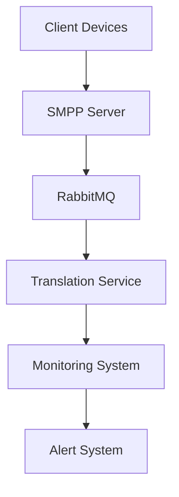
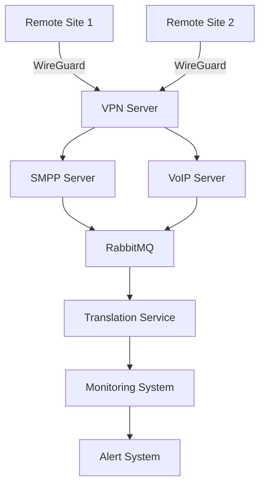
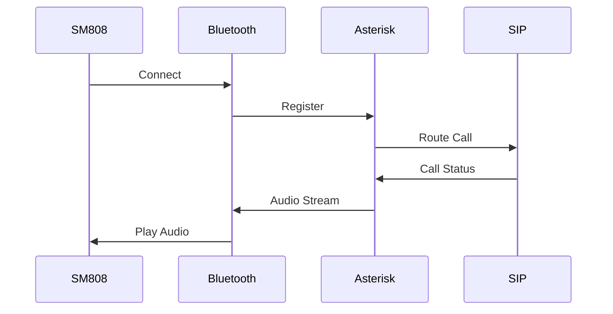
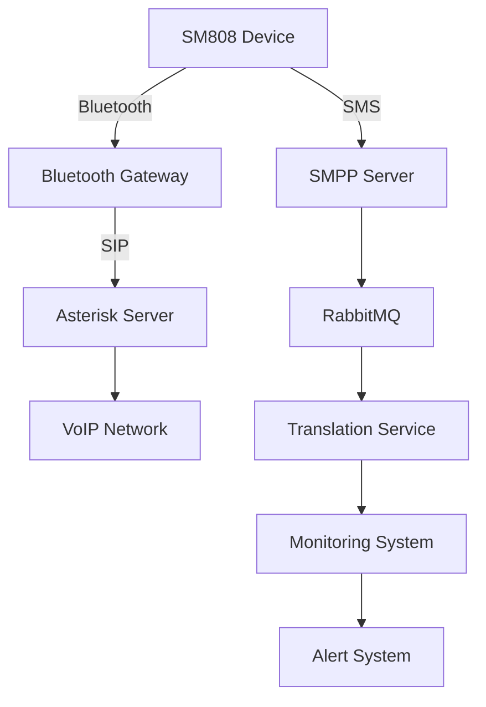

# SM808 Communication System Technical Documentation

## Table of Contents
1. [System Overview](#system-overview)
2. [Technical Specifications](#technical-specifications)
3. [Architecture](#architecture)
4. [Implementation Details](#implementation-details)
5. [Configuration Guide](#configuration-guide)
6. [API Documentation](#api-documentation)
7. [Monitoring and Alerts](#monitoring-and-alerts)
8. [Troubleshooting Guide](#troubleshooting-guide)
9. [Network Configuration](#network-configuration)
10. [VoIP Integration](#voip-integration)

## System Overview

### Purpose
The SM808 Communication System is designed to provide robust SMS and USSD communication capabilities with advanced features including:
- Multi-country device management
- Pre-translation services
- SIM block detection
- Real-time monitoring
- Queue management

### Key Features
- SMPP-based messaging
- Multi-language support
- Device tracking across countries
- SIM card management
- Automated alerts
- Real-time monitoring

## Technical Specifications

### Hardware Requirements
| Component | Specification |
|-----------|--------------|
| SM808 Module | GSM/GPRS Module |
| Arduino UNO | Microcontroller |
| Power Supply | 5V DC |
| SIM Card | Standard SIM |

### Software Requirements
| Component | Version | Notes |
|-----------|---------|-------|
| .NET Core | 6.0+ | Server-side |
| Inetlab SMPP | Latest | SMS handling |
| RabbitMQ | 3.8+ | Message queue |
| Grafana | 8.0+ | Monitoring |
| Arduino IDE | 1.8+ | Client-side |

## Architecture

### System Components


### Data Flow
1. Client sends message
2. SMPP server receives
3. Translation service processes
4. Queue management handles
5. Monitoring system tracks
6. Alert system notifies

## Implementation Details

### Server-Side Implementation
```csharp
public class SmppServerManager
{
    private readonly SmppServer _server;
    private readonly ITranslationService _translation;
    private readonly ISimBlockMonitor _blockMonitor;

    public async Task StartServer()
    {
        _server = new SmppServer();
        _server.Start("0.0.0.0", 2775);
        
        // Event handlers
        _server.ClientConnected += OnClientConnected;
        _server.MessageReceived += OnMessageReceived;
    }

    private async void OnMessageReceived(object sender, MessageEventArgs args)
    {
        var message = args.Message;
        var translated = await _translation.TranslateMessage(
            message.Text,
            GetTargetLanguage(message.DestinationAddress)
        );
        
        await ProcessMessage(translated);
    }
}
```

### Client-Side Implementation
```arduino
class SM808Manager {
private:
    SoftwareSerial gsmSerial;
    String deviceId;
    String simId;

public:
    void setup() {
        gsmSerial.begin(9600);
        initializeModule();
    }

    void checkSimStatus() {
        String status = getSimStatus();
        if (status == "BLOCKED") {
            sendAlert();
        }
    }
};
```

## Configuration Guide

### Server Configuration
```json
{
    "SmppServer": {
        "Host": "0.0.0.0",
        "Port": 2775,
        "SystemId": "your_system_id",
        "Password": "your_password"
    },
    "RabbitMQ": {
        "Host": "localhost",
        "Port": 5672,
        "QueueName": "sms_queue"
    },
    "Translation": {
        "ApiKey": "your_api_key",
        "DefaultLanguage": "en"
    }
}
```

### Client Configuration
```arduino
#define SIM_PIN "1234"
#define APN "your.apn"
#define SMS_CENTER "+1234567890"
```

## API Documentation

### SMPP Server API
| Endpoint | Method | Description |
|----------|--------|-------------|
| /api/sms/send | POST | Send SMS |
| /api/sms/status | GET | Check SMS status |
| /api/device/status | GET | Device status |
| /api/sim/status | GET | SIM status |

### Translation API
```csharp
public interface ITranslationService
{
    Task<string> TranslateMessage(string text, string targetLanguage);
    Task<string> DetectLanguage(string text);
    Task<string[]> GetSupportedLanguages();
}
```

## Monitoring and Alerts

### Alert Types
1. SIM Block Alert
   - Trigger: SIM card blocked
   - Action: Notify admin, log event
   - Priority: High

2. Device Offline Alert
   - Trigger: Device not responding
   - Action: Send notification
   - Priority: Medium

3. Queue Overflow Alert
   - Trigger: Queue size exceeds limit
   - Action: Scale processing
   - Priority: High

### Monitoring Dashboard
- Real-time metrics
- Historical data
- Alert history
- Device status
- SIM status

## Troubleshooting Guide

### Common Issues

#### 1. Connection Issues
**Symptoms:**
- Device not connecting
- SMS not sending
- USSD commands failing

**Solutions:**
1. Check network settings
2. Verify APN configuration
3. Test signal strength
4. Check SIM status

#### 2. Translation Issues
**Symptoms:**
- Messages not translated
- Wrong language detection
- Translation errors

**Solutions:**
1. Verify API key
2. Check language support
3. Test translation service
4. Monitor error logs

#### 3. SIM Block Issues
**Symptoms:**
- SIM not working
- Block alerts triggered
- No network access

**Solutions:**
1. Check block status
2. Verify SIM profile
3. Test alternative SIM
4. Contact provider

### Error Codes
| Code | Description | Action |
|------|-------------|--------|
| E001 | Connection failed | Check network |
| E002 | SIM blocked | Replace SIM |
| E003 | Translation error | Verify API |
| E004 | Queue full | Scale system |

## Best Practices

### Security
1. Use secure connections
2. Encrypt sensitive data
3. Regular security updates
4. Access control

### Performance
1. Monitor queue size
2. Scale when needed
3. Cache translations
4. Optimize queries

### Maintenance
1. Regular backups
2. System updates
3. Log rotation
4. Health checks

## Network Configuration

### WireGuard VPN Setup
```ini
# Server Configuration (wg0.conf)
[Interface]
PrivateKey = [server_private_key]
Address = 10.0.0.1/24
ListenPort = 51820
PostUp = iptables -A FORWARD -i %i -j ACCEPT; iptables -A FORWARD -o %i -j ACCEPT; iptables -t nat -A POSTROUTING -o eth0 -j MASQUERADE
PostDown = iptables -D FORWARD -i %i -j ACCEPT; iptables -D FORWARD -o %i -j ACCEPT; iptables -t nat -D POSTROUTING -o eth0 -j MASQUERADE

[Peer]
PublicKey = [client_public_key]
AllowedIPs = 10.0.0.2/32
```

### Client Configuration
```ini
# Client Configuration (wg0.conf)
[Interface]
PrivateKey = [client_private_key]
Address = 10.0.0.2/24
DNS = 8.8.8.8

[Peer]
PublicKey = [server_public_key]
Endpoint = 142.171.22.178:51820
AllowedIPs = 0.0.0.0/0
PersistentKeepalive = 25
```

### Network Requirements
| Component | Specification |
|-----------|--------------|
| WireGuard Server | Ubuntu 20.04+ |
| Server IP | 142.171.22.178 |
| VPN Port | 51820 |
| Protocol | UDP |
| Encryption | ChaCha20 |

### Site-to-Site Configuration
1. **Primary Site**
   - WireGuard Server
   - SMPP Server
   - VoIP Server
   - Monitoring System

2. **Remote Sites**
   - WireGuard Client
   - SM808 Devices
   - Local Network

## VoIP Integration

### VoIP Server Configuration
```ini
# Asterisk Configuration (sip.conf)
[general]
context=default
allowoverlap=no
udpbindaddr=0.0.0.0:5060
tcpenable=no
tcpbindaddr=0.0.0.0:5060
transport=udp

[sm808-device]
type=friend
host=dynamic
secret=your_secret
context=sm808-context
```

### VoIP Features
1. **Basic Features**
   - Voice calls
   - Call forwarding
   - Voicemail
   - Call recording

2. **Advanced Features**
   - Conference calls
   - Call queuing
   - Interactive Voice Response (IVR)
   - Call analytics

### Integration with SM808
```csharp
public class VoipManager
{
    private readonly AsteriskManager _asterisk;
    private readonly ISm808Device _device;

    public async Task InitializeVoip()
    {
        await _asterisk.Connect("localhost", 5038, "admin", "your_password");
        await RegisterDevice(_device);
    }

    public async Task MakeCall(string destination)
    {
        await _asterisk.OriginateCall(_device.Extension, destination);
    }
}
```

### Network Security
1. **VPN Security**
   - Strong encryption
   - Regular key rotation
   - IP whitelisting
   - Connection monitoring

2. **VoIP Security**
   - SIP TLS encryption
   - SRTP for media
   - Authentication
   - Access control

### Performance Monitoring
1. **VPN Metrics**
   - Connection status
   - Bandwidth usage
   - Latency
   - Packet loss

2. **VoIP Metrics**
   - Call quality
   - Jitter
   - MOS score
   - Call success rate

## Updated Architecture

### System Components with VPN


### Data Flow with VPN
1. Remote site connects via WireGuard
2. Secure tunnel established
3. SMPP and VoIP traffic routed
4. Services process requests
5. Monitoring system tracks
6. Alert system notifies

## Updated Configuration Guide

### Server Configuration
```json
{
    "SmppServer": {
        "Host": "0.0.0.0",
        "Port": 2775,
        "SystemId": "your_system_id",
        "Password": "your_password"
    },
    "RabbitMQ": {
        "Host": "localhost",
        "Port": 5672,
        "QueueName": "sms_queue"
    },
    "Translation": {
        "ApiKey": "your_api_key",
        "DefaultLanguage": "en"
    },
    "WireGuard": {
        "ServerIP": "142.171.22.178",
        "Port": 51820,
        "Network": "10.0.0.0/24"
    },
    "VoIP": {
        "Server": "localhost",
        "Port": 5060,
        "Protocol": "SIP"
    }
}
```

### Client Configuration
```arduino
#define SIM_PIN "1234"
#define APN "your.apn"
#define SMS_CENTER "+1234567890"
#define VPN_SERVER "142.171.22.178"
#define VPN_PORT 51820
```

## Updated Troubleshooting Guide

### VPN Connection Issues
**Symptoms:**
- Cannot connect to VPN
- High latency
- Packet loss
- Connection drops

### VoIP Quality Issues
**Symptoms:**
- Poor call quality
- Call drops
- Audio delay
- Echo issues

### Error Codes
| Code | Description | Action |
|------|-------------|--------|
| E001 | Connection failed | Check network |
| E002 | SIM blocked | Replace SIM |
| E003 | Translation error | Verify API |
| E004 | Queue full | Scale system |
| E005 | VPN connection failed | Check VPN config |
| E006 | VoIP call failed | Check VoIP settings |

## Best Practices

### Network Security
1. Use WireGuard VPN
2. Implement strong encryption
3. Regular security audits
4. Monitor network traffic

### VoIP Best Practices
1. Quality of Service (QoS)
2. Regular codec optimization
3. Network monitoring
4. Backup routes

### Maintenance
1. Regular VPN key rotation
2. VoIP server updates
3. Network performance checks
4. Security patches

## Hardware Requirements

### Server Requirements
| Component | Specification |
|-----------|--------------|
| Mini PC | Intel Core i7 |
| RAM | 16GB DDR4 |
| Storage | 256GB SSD |
| Network | Gigabit Ethernet |
| USB Ports | 4x USB 3.0 |
| Bluetooth | 5.0+ |

### SM808 Module Requirements
| Component | Specification |
|-----------|--------------|
| Module | SIM808 |
| Bluetooth | 4.0+ |
| Voice Support | Yes |
| Audio Codec | AMR-NB |
| Power Supply | 5V DC |

## Bluetooth Voice Integration

### SM808 Bluetooth Configuration
```arduino
class SM808BluetoothManager {
private:
    SoftwareSerial bluetoothSerial;
    String deviceName = "SM808_Voice";
    String pinCode = "1234";

public:
    void setupBluetooth() {
        bluetoothSerial.begin(9600);
        sendATCommand("AT+BTNAME=" + deviceName);
        sendATCommand("AT+BTPIN=" + pinCode);
        sendATCommand("AT+BTAUDIO=1"); // Enable audio
    }

    void connectToAsterisk() {
        sendATCommand("AT+BTSCAN=1");
        // Wait for Asterisk device
        String asteriskDevice = findAsteriskDevice();
        sendATCommand("AT+BTCONNECT=" + asteriskDevice);
    }
};
```

### Asterisk Bluetooth Configuration
```ini
# Asterisk Bluetooth Configuration (bluetooth.conf)
[general]
discovery=yes
device=SM808_Voice
pin=1234

[sm808-device]
type=friend
context=bluetooth-context
```

### Voice Call Flow


## Server Setup

### Mini PC Configuration
```bash
# System Requirements Check
lscpu | grep "Model name"
free -h | grep "Mem"
lsblk | grep "disk"
```

### Performance Optimization
```ini
# System Configuration (/etc/sysctl.conf)
vm.swappiness=10
vm.dirty_ratio=60
vm.dirty_background_ratio=2
net.core.somaxconn=4096
```

### Resource Monitoring
```bash
# Monitoring Script
#!/bin/bash
while true; do
    cpu=$(top -bn1 | grep "Cpu(s)" | awk '{print $2}')
    mem=$(free -m | awk 'NR==2{printf "%.2f%%", $3*100/$2}')
    echo "CPU: $cpu% | Memory: $mem"
    sleep 5
done
```

## Updated Architecture

### System Components with Bluetooth


## Updated Configuration Guide

### Server Configuration
```json
{
    "Hardware": {
        "CPU": "Intel Core i7",
        "RAM": "16GB",
        "Storage": "256GB SSD",
        "Bluetooth": "5.0+"
    },
    "SmppServer": {
        "Host": "0.0.0.0",
        "Port": 2775,
        "SystemId": "your_system_id",
        "Password": "your_password"
    },
    "Bluetooth": {
        "DeviceName": "SM808_Voice",
        "PinCode": "1234",
        "AudioCodec": "AMR-NB"
    },
    "Asterisk": {
        "Host": "localhost",
        "Port": 5060,
        "BluetoothEnabled": true
    }
}
```

### Client Configuration
```arduino
#define SIM_PIN "1234"
#define APN "your.apn"
#define SMS_CENTER "+1234567890"
#define BLUETOOTH_NAME "SM808_Voice"
#define BLUETOOTH_PIN "1234"
#define AUDIO_ENABLED true
```

## Updated Troubleshooting Guide

### Bluetooth Connection Issues
**Symptoms:**
- Cannot pair devices
- Audio quality issues
- Connection drops
- No audio output

### Voice Quality Issues
**Symptoms:**
- Poor audio quality
- Echo problems
- Audio delay
- No audio input

### Error Codes
| Code | Description | Action |
|------|-------------|--------|
| E001 | Connection failed | Check network |
| E002 | SIM blocked | Replace SIM |
| E003 | Translation error | Verify API |
| E004 | Queue full | Scale system |
| E005 | VPN connection failed | Check VPN config |
| E006 | VoIP call failed | Check VoIP settings |
| E007 | Bluetooth connection failed | Check BT config |
| E008 | Audio stream failed | Check audio settings |

## Best Practices

### Bluetooth Best Practices
1. Regular device scanning
2. Signal strength monitoring
3. Codec optimization
4. Battery management

### Voice Quality Optimization
1. Use appropriate codecs
2. Monitor audio latency
3. Regular quality checks
4. Backup audio routes

### System Performance
1. Monitor CPU usage
2. Check memory utilization
3. Optimize storage
4. Regular maintenance

## Advanced Bluetooth Configuration

### Detailed Pairing Process
```arduino
class SM808BluetoothManager {
private:
    SoftwareSerial bluetoothSerial;
    String deviceName = "SM808_Voice";
    String pinCode = "1234";
    int signalStrength = 0;
    bool isPaired = false;

public:
    void initializeBluetooth() {
        // Basic setup
        bluetoothSerial.begin(9600);
        delay(1000);
        
        // Reset module
        sendATCommand("AT+BTINIT=1");
        delay(2000);
        
        // Set device name
        sendATCommand("AT+BTNAME=" + deviceName);
        delay(1000);
        
        // Set PIN code
        sendATCommand("AT+BTPIN=" + pinCode);
        delay(1000);
        
        // Enable audio
        sendATCommand("AT+BTAUDIO=1");
        delay(1000);
        
        // Set audio parameters
        configureAudioParameters();
    }

    void configureAudioParameters() {
        // Set audio codec
        sendATCommand("AT+BTAUDIOCODEC=AMR-NB");
        delay(500);
        
        // Set sample rate
        sendATCommand("AT+BTAUDIOSR=8000");
        delay(500);
        
        // Set bit rate
        sendATCommand("AT+BTAUDIOBR=12200");
        delay(500);
        
        // Enable noise reduction
        sendATCommand("AT+BTAUDIONR=1");
    }

    bool pairWithAsterisk() {
        // Start discovery
        sendATCommand("AT+BTSCAN=1");
        delay(5000); // Wait for scan
        
        // Get discovered devices
        String devices = sendATCommand("AT+BTSCAN?");
        
        // Find Asterisk device
        String asteriskDevice = findAsteriskDevice(devices);
        if (asteriskDevice.length() > 0) {
            // Connect to Asterisk
            sendATCommand("AT+BTCONNECT=" + asteriskDevice);
            delay(2000);
            
            // Verify connection
            String status = sendATCommand("AT+BTCONN?");
            isPaired = status.indexOf("CONNECTED") != -1;
            
            if (isPaired) {
                // Configure audio stream
                setupAudioStream();
            }
        }
        return isPaired;
    }

    void monitorConnection() {
        // Check signal strength
        signalStrength = getSignalStrength();
        
        // Check connection status
        String status = sendATCommand("AT+BTCONN?");
        
        // Handle connection issues
        if (status.indexOf("DISCONNECTED") != -1) {
            handleDisconnection();
        }
        
        // Monitor audio quality
        monitorAudioQuality();
    }
};
```

### Voice Quality Optimization

#### Audio Configuration
```ini
# Asterisk Audio Configuration (audio.conf)
[general]
codec=amr
samplerate=8000
bitrate=12200
echocancel=yes
noisereduction=yes
jitterbuffer=yes

[sm808-device]
codec=amr
samplerate=8000
bitrate=12200
echocancel=yes
noisereduction=yes
jitterbuffer=yes
```

#### Quality Monitoring Script
```bash
#!/bin/bash

# Audio Quality Monitoring Script
monitor_audio_quality() {
    while true; do
        # Check audio latency
        latency=$(check_audio_latency)
        
        # Check packet loss
        packet_loss=$(check_packet_loss)
        
        # Check jitter
        jitter=$(check_jitter)
        
        # Calculate MOS score
        mos_score=$(calculate_mos $latency $packet_loss $jitter)
        
        # Log results
        echo "$(date) - Latency: $latency ms, Packet Loss: $packet_loss%, Jitter: $jitter ms, MOS: $mos_score" >> /var/log/audio_quality.log
        
        # Alert if quality is poor
        if [ $(echo "$mos_score < 3.5" | bc) -eq 1 ]; then
            send_alert "Poor audio quality detected: MOS $mos_score"
        fi
        
        sleep 60
    done
}

# System Performance Monitoring
monitor_system_performance() {
    while true; do
        # CPU Usage
        cpu_usage=$(top -bn1 | grep "Cpu(s)" | awk '{print $2}')
        
        # Memory Usage
        mem_usage=$(free -m | awk 'NR==2{printf "%.2f%%", $3*100/$2}')
        
        # Disk I/O
        disk_io=$(iostat -x 1 1 | awk 'NR==4{print $14}')
        
        # Network Usage
        net_usage=$(ifstat 1 1 | awk 'NR==3{print $2}')
        
        # Log results
        echo "$(date) - CPU: $cpu_usage%, Memory: $mem_usage, Disk I/O: $disk_io, Network: $net_usage" >> /var/log/system_performance.log
        
        # Alert if thresholds exceeded
        if [ $(echo "$cpu_usage > 80" | bc) -eq 1 ]; then
            send_alert "High CPU usage: $cpu_usage%"
        fi
        
        sleep 300
    done
}

# Start monitoring
monitor_audio_quality &
monitor_system_performance &
```

### System Performance Optimization

#### Kernel Parameters
```ini
# System Optimization (/etc/sysctl.conf)
# Network Optimization
net.core.rmem_max=16777216
net.core.wmem_max=16777216
net.ipv4.tcp_rmem=4096 87380 16777216
net.ipv4.tcp_wmem=4096 87380 16777216
net.ipv4.tcp_congestion_control=cubic

# Memory Management
vm.swappiness=10
vm.dirty_ratio=60
vm.dirty_background_ratio=2
vm.overcommit_memory=1

# Process Management
kernel.pid_max=65536
kernel.threads-max=65536
```

#### Resource Allocation
```bash
#!/bin/bash

# Resource Allocation Script
allocate_resources() {
    # Set CPU affinity
    taskset -cp 0,1,2,3 $(pgrep asterisk)
    
    # Set process priority
    renice -n -10 $(pgrep asterisk)
    
    # Allocate memory
    echo 1000000000 > /sys/fs/cgroup/memory/asterisk/memory.limit_in_bytes
    
    # Set network priority
    tc qdisc add dev eth0 root handle 1: htb default 10
    tc class add dev eth0 parent 1: classid 1:1 htb rate 1000mbit
    tc class add dev eth0 parent 1:1 classid 1:10 htb rate 500mbit
    tc filter add dev eth0 protocol ip parent 1:0 prio 1 u32 match ip dport 5060 0xffff flowid 1:10
}
```

### Advanced Troubleshooting

#### Bluetooth Connection Diagnostics
```bash
#!/bin/bash

# Bluetooth Diagnostics Script
check_bluetooth_connection() {
    # Check Bluetooth service
    systemctl status bluetooth
    
    # Check device visibility
    hciconfig hci0
    
    # Check paired devices
    bluetoothctl paired-devices
    
    # Check signal strength
    hcitool rssi $(bluetoothctl paired-devices | awk '{print $2}')
    
    # Check audio profile
    pactl list cards | grep -A 10 "bluetooth"
}

# Audio Quality Diagnostics
check_audio_quality() {
    # Check audio devices
    arecord -l
    
    # Test audio recording
    arecord -d 5 -f cd test.wav
    
    # Analyze audio quality
    sox test.wav -n stat
    
    # Check audio latency
    jack_lsp
    
    # Monitor audio buffer
    cat /proc/asound/card0/pcm0p/sub0/status
}
```

### Performance Metrics Dashboard

#### Grafana Configuration
```json
{
    "dashboard": {
        "panels": [
            {
                "title": "Bluetooth Connection",
                "type": "graph",
                "metrics": [
                    "bluetooth_signal_strength",
                    "bluetooth_connection_status",
                    "bluetooth_audio_quality"
                ]
            },
            {
                "title": "System Performance",
                "type": "graph",
                "metrics": [
                    "cpu_usage",
                    "memory_usage",
                    "disk_io",
                    "network_usage"
                ]
            },
            {
                "title": "Audio Quality",
                "type": "graph",
                "metrics": [
                    "audio_latency",
                    "packet_loss",
                    "jitter",
                    "mos_score"
                ]
            }
        ]
    }
}
```

## Best Practices

### Bluetooth Optimization
1. Regular device scanning
2. Signal strength monitoring
3. Codec optimization
4. Battery management
5. Interference avoidance
6. Regular reconnection checks
7. Audio buffer optimization
8. Error correction

### Voice Quality Management
1. Use appropriate codecs
2. Monitor audio latency
3. Regular quality checks
4. Backup audio routes
5. Noise reduction
6. Echo cancellation
7. Jitter buffer optimization
8. Packet loss recovery

### System Performance
1. Monitor CPU usage
2. Check memory utilization
3. Optimize storage
4. Regular maintenance
5. Resource allocation
6. Process prioritization
7. Network optimization
8. Regular backups 